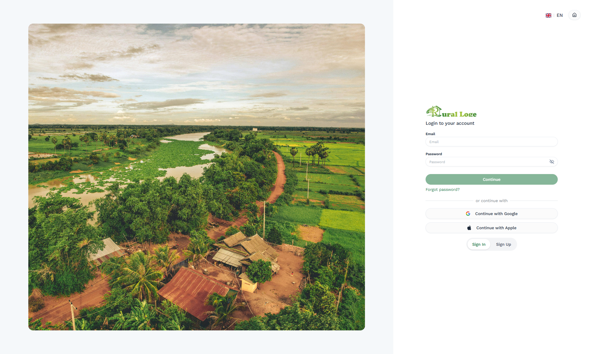
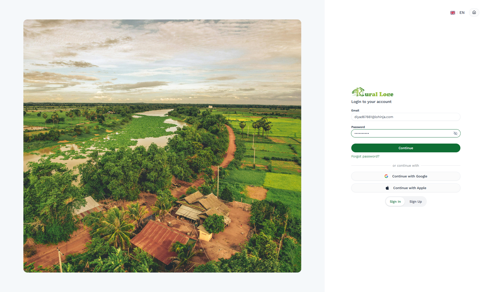
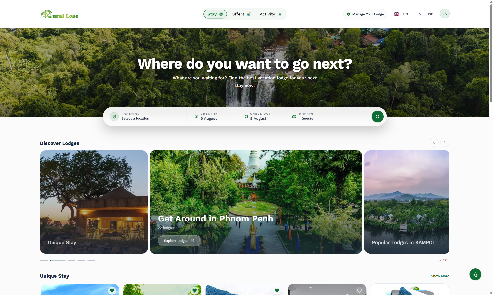
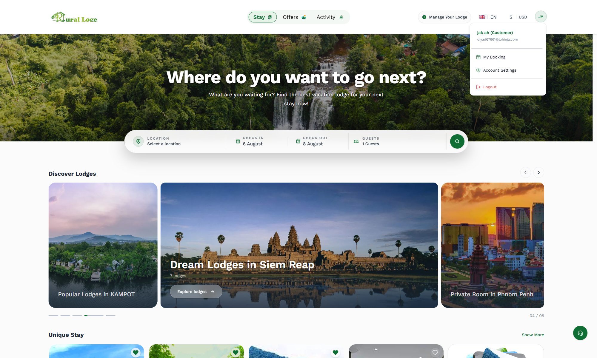
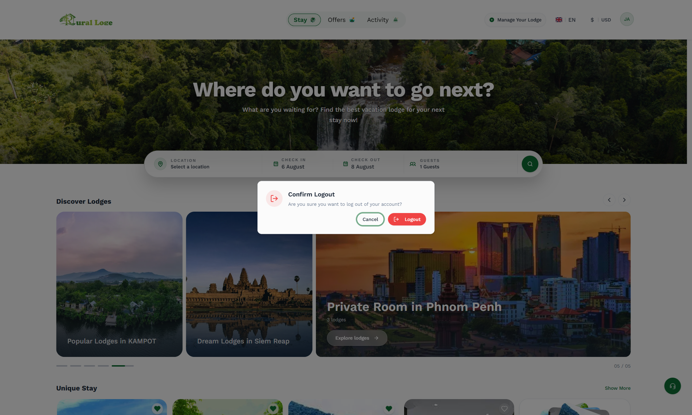
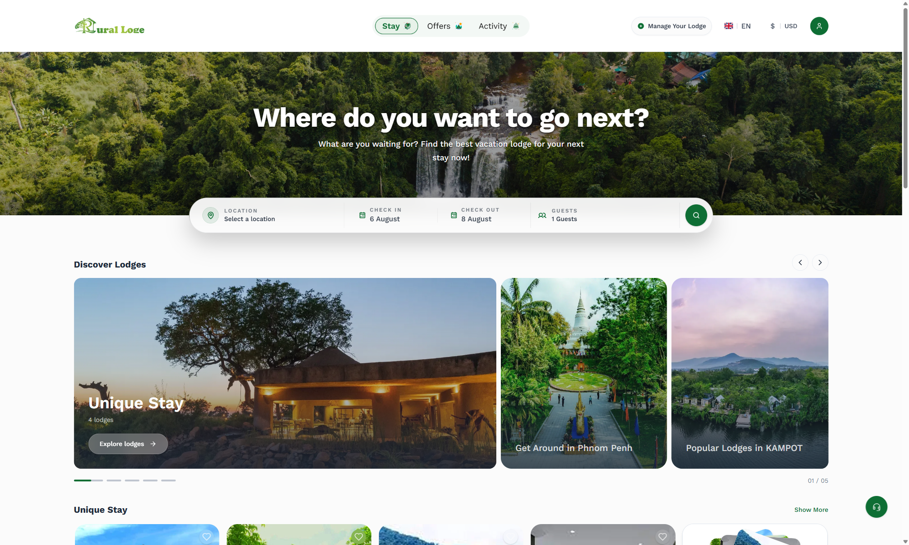
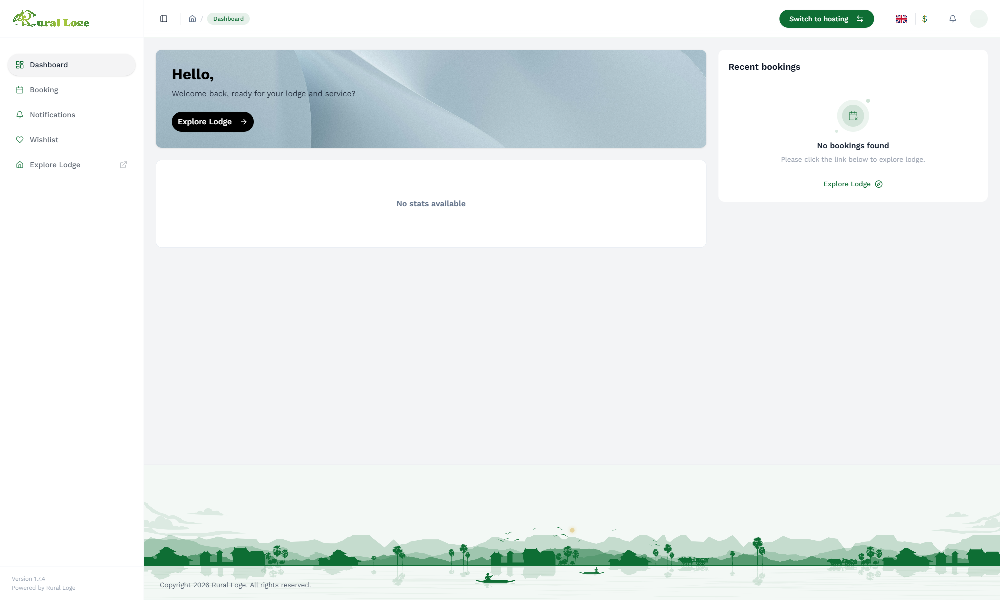

# DEFECT-1: Protected route silently renders a broken shell instead of redirecting to login, after logout

| Field | Value |
|---|---|
| **Status** | Confirmed, open (not fixed) |
| **Severity** | High |
| **Component** | Route guard / session handling — `/{locale}/customer/dashboard` (and, by the same root cause, likely every other route under `/{locale}/customer/*`) |
| **Environment** | https://staging-ruralloge.allweb.cloud (staging) |
| **First found** | 2026-08-04, manual exploratory testing (Step 3) |
| **Automated regression tests** | `tests/rural-lodge-test/authentication/006_protected-route-after-logout-defect.spec.ts`<br>`tests/rural-lodge-test/error-handling/002_protected-route-silent-failure-defect.spec.ts` |
| **Reproduction rate** | 100% — reproduces on every automated run |
| **Violates** | AC1 (Authentication): "protected routes redirect back to /login" after logout<br>Error Handling AC: "no silent failure or broken page" |

---

## Summary

After a user logs in and then logs out, directly navigating to a protected route
(`/en/customer/dashboard`) does **not** redirect to `/login` or the localized `/en/auth` as the
product requires. Instead, the page renders a fully-styled but **broken dashboard shell** — a
sidebar, a greeting with no name ("Hello,"), stat tiles reading "No stats available", and a
"Recent bookings" panel reading "No bookings found" — while the browser console silently fills
with authentication-token errors that are **never surfaced to the user in any visible way**. A
user with no console open has no indication anything is wrong; the page looks like a legitimately
empty account, not a failed/logged-out session.

## Preconditions

- A real login + logout cycle must have happened in this browser session first. Visiting the
  protected route cold (a fresh browser context that has never logged in) correctly redirects to
  login — **this defect only reproduces after a login followed by a logout**, which is what leaves
  the stale cookie described in Root Cause below.

## Steps to Reproduce

### 1. Go to the login page and sign in with a valid account

Navigate to `/en/auth`. The login form is empty and "Continue" is disabled until both fields are
filled.



Fill in a valid email/password (`TEST_USER_EMAIL` / `TEST_USER_PASSWORD`). "Continue" becomes
enabled.



### 2. Click Continue — redirected to the public home page, now authenticated

Click **Continue**. The app redirects to `/en` (the public home page, **not** a dashboard — see
the story-vs-reality note in `user-stories/SCRUM.md`). The header's generic login icon is now
replaced by a user-initials button ("JA" in this capture).



### 3. Open the account menu and log out

Click the initials button to open the account menu (name, email, "My Booking", "Account
Settings", "Logout").



Click **Logout**. A **Confirm Logout** dialog appears: "Are you sure you want to log out of your
account?", with **Cancel** and a red **Logout** button.



Click the dialog's **Logout** button to confirm. The dialog closes and the header reverts to the
generic (logged-out) login icon.

> **This step itself is correct, not part of the defect.** After confirming logout, the app
> correctly stays on/returns to the public landing page (`/en`) in a genuinely logged-out state —
> no user session, generic login icon in the header. Logout does not force a redirect to any
> other page, and that is expected behavior, not a bug. **The defect only appears in the next
> step**, when a *protected* route is opened directly afterward.



### 4. Navigate directly to the protected dashboard route

With no further clicks — just a direct navigation (paste the URL, or `page.goto()` in an
automated test) — go to:

```
https://staging-ruralloge.allweb.cloud/en/customer/dashboard
```

**Expected:** immediate redirect to `/login` or the localized `/en/auth`, matching every other
protected-route guard in the app (compare: clicking "Manage Your Lodge" while logged out correctly
redirects to `/en/auth?returnUrl=%2F` — this defect is specifically about routes under
`/customer/*`, not a blanket auth-gating gap).

**Actual:** the URL stays on `/en/customer/dashboard`. The full dashboard shell renders:



- Greeting reads **"Hello,"** — no name.
- Stat tiles read **"No stats available"**.
- "Recent bookings" panel reads **"No bookings found" / "Please click the link below to explore lodge."**
- Nothing on the page itself indicates a failure. It reads as a legitimately empty, logged-in
  account — not as a rejected/expired session.

### 5. Open the browser console — the only place the failure is visible

Seven errors appear, all `TRPCClientError: Authentication token not found in cookies`, across
three separate calls:

```
TRPCClientError: Authentication token not found in cookies
  at notifications.getMy        (x2)
  at notifications.getUnreadCount (x2)
  at booking.getBookings        (x3)
```

The data-fetching layer correctly detects that there is no valid session and fails every call —
but nothing in the UI ever surfaces that failure. A real user, who never opens devtools, sees only
a plausible-looking empty dashboard.

## Root Cause (hypothesis, from live cookie inspection)

Immediately after confirming logout, `document.cookie` was inspected directly (`page.evaluate`) and
still contained a `user=...` cookie holding what looks like a valid session token (an `st` field
with `exp`/`iat` claims that had not yet expired) — even though the actual auth-token cookie that
the tRPC data layer reads had been correctly cleared.

This strongly suggests:

- **Logout only clears the primary auth-token cookie, not the separate `user` info cookie.**
- **The route guard/shell that decides whether to render the dashboard checks only for the
  presence of the `user` cookie**, not whether the real session is still valid — so it lets the
  shell render.
- **The data-fetching hooks (tRPC) correctly check for the real auth token** and fail loudly (in
  the console) when it's missing — which is *why* the failure is real and reproducible, but also
  why it's invisible to the guard that gated the page in the first place.

In short: two different parts of the app are checking two different things for "am I logged in?",
and only one of them is correct.

## Suggested Fix

1. **Logout should clear every auth-related cookie**, not just the primary token — including
   `user`.
2. **The route guard for `/customer/*` (and any sibling protected routes) should validate the real
   session/auth token**, the same signal the tRPC data layer already correctly checks — not the
   mere presence of the `user` info cookie.
3. As a secondary defense-in-depth measure: if the data layer detects a missing/invalid auth token
   on a protected page, that should itself trigger a redirect to login rather than silently
   rendering an empty-looking shell.

## Impact

- A user whose session has actually ended (via explicit logout, or potentially any other event
  that only clears the primary token) sees what looks like their own account with no bookings/
  stats, not a "please log in again" prompt. This could cause real confusion ("did I lose my
  booking history?") and support load, and it fails the product's own stated Error Handling
  requirement ("no silent failure or broken page").
- Both automated regression tests below are written to assert the *correct* expected behavior
  (redirect to login) specifically so they keep failing — and stay visible in every test run —
  until this is fixed, rather than encoding the bug into the assertion.

## Where this is covered in automation

```ts
// tests/rural-lodge-test/authentication/006_protected-route-after-logout-defect.spec.ts
test('KNOWN DEFECT: protected route after logout should redirect to login, not render a broken dashboard', ...)

// tests/rural-lodge-test/error-handling/002_protected-route-silent-failure-defect.spec.ts
test('DEFECT: protected route after logout should redirect to login instead of silently rendering a broken dashboard shell', ...)
```

Both perform the identical login → logout → direct-navigate-to-`/customer/dashboard` sequence
above and assert `expect(page).toHaveURL(/\/(en\/)?(auth|login)/)`, which times out and fails —
by design — until this defect is fixed.
